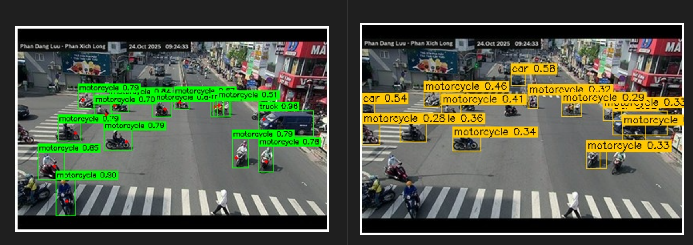

## **TRAAA - MÔ HÌNH ĐÁNH GIÁ TẮC NGHẼN GIAO THÔNG**

> project III - soict | hust  

#### REPORT:
- **week 1-2-3-4**: ...
- **week 5-6**: gán nhãn, fine-tune model detect phương tiện tốt hơn và gắn thêm keypoint xác định hướng phương tiện:  

  
  

