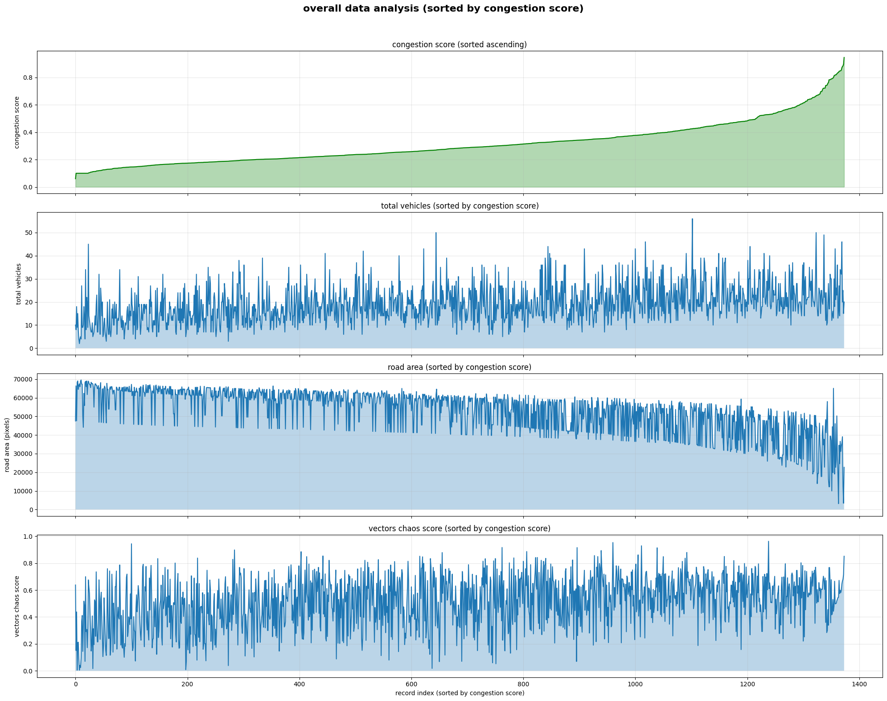
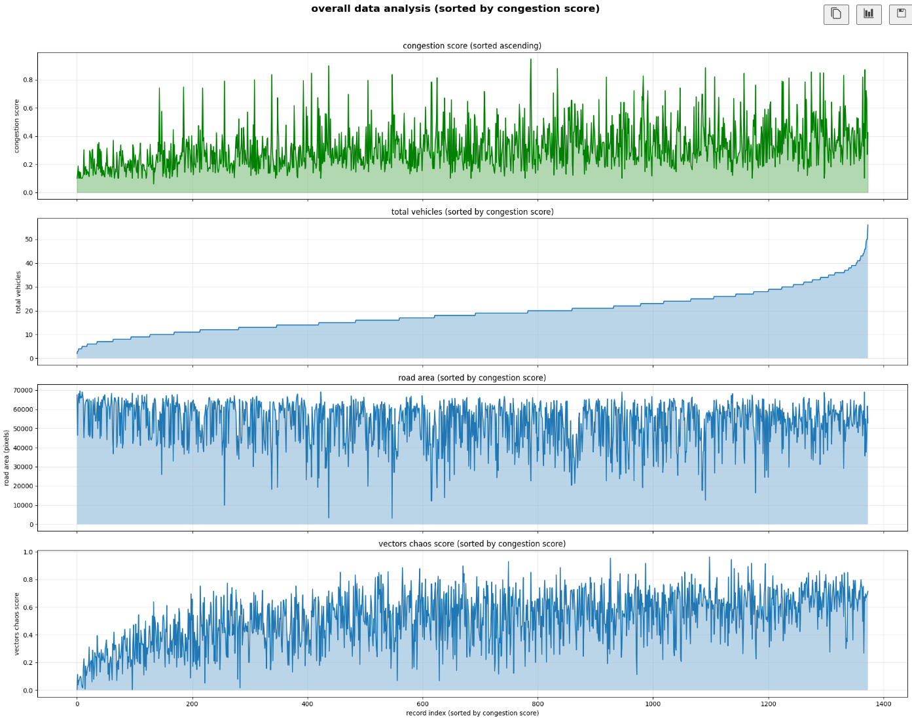
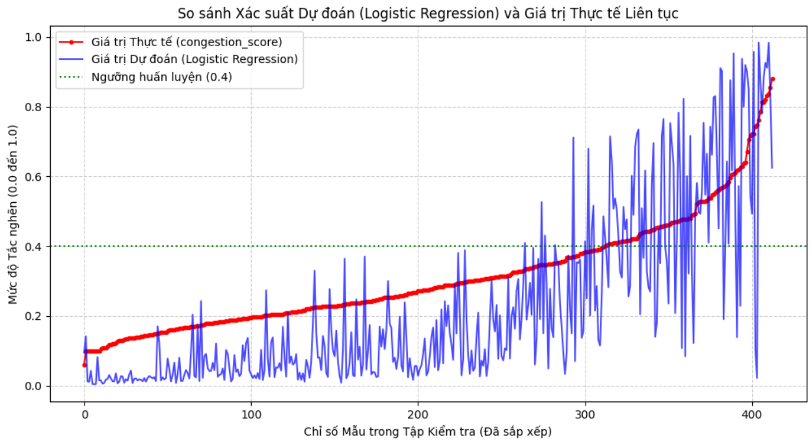
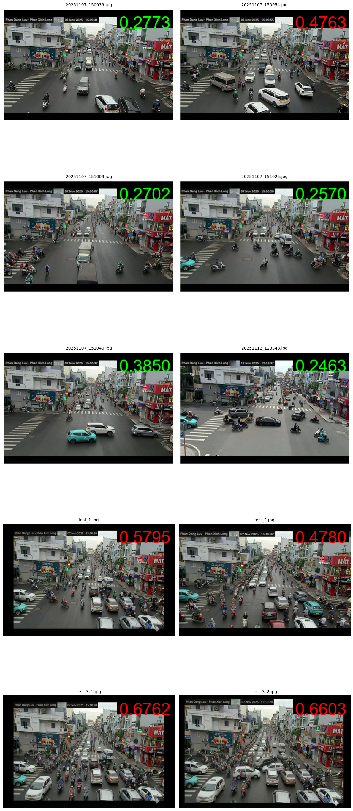
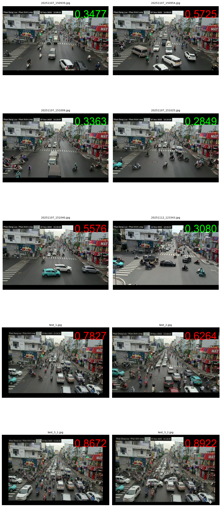

## **TRAAA - MÔ HÌNH ĐÁNH GIÁ TẮC NGHẼN GIAO THÔNG**

> project III - soict | hust  

#### REPORT:
- **week 1-2-3-4**: ...
- **week 5-6**: gán nhãn, fine-tune model detect phương tiện tốt hơn và gắn thêm keypoint xác định hướng phương tiện:  

  
  

- **week7-8: Vector map**:   *v.10nov*

  

- **week9-10-11-12: data processing**:   *v.1dec*  

- **week13: model training + prediction**:   *v.6dec*
  - 1 camera dataset only  
  

| model predicted | frames |
|---|---|
|  |  |  

- **week15: improve data quality**:   *v.25dec*
> sorted by final score  
  
> sort by total vehicles  
  
> compare predict and real data  
  

> model compared

  
  

